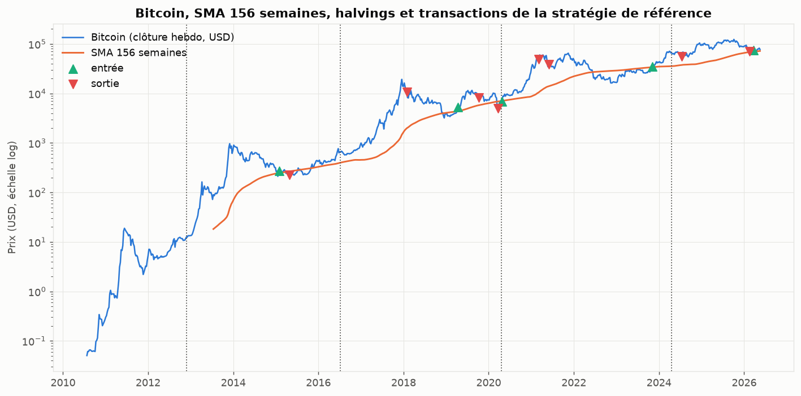
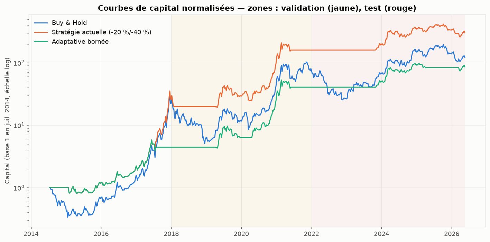
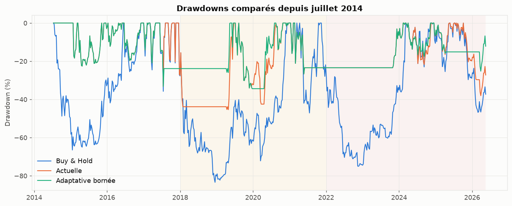
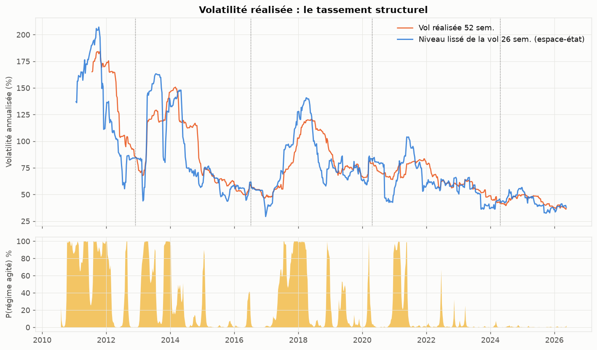
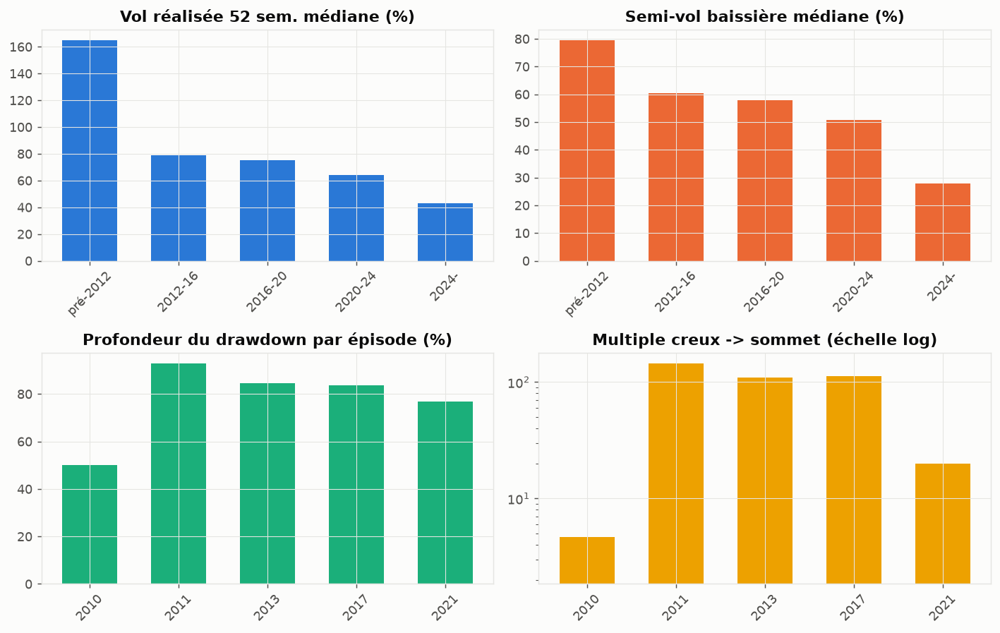
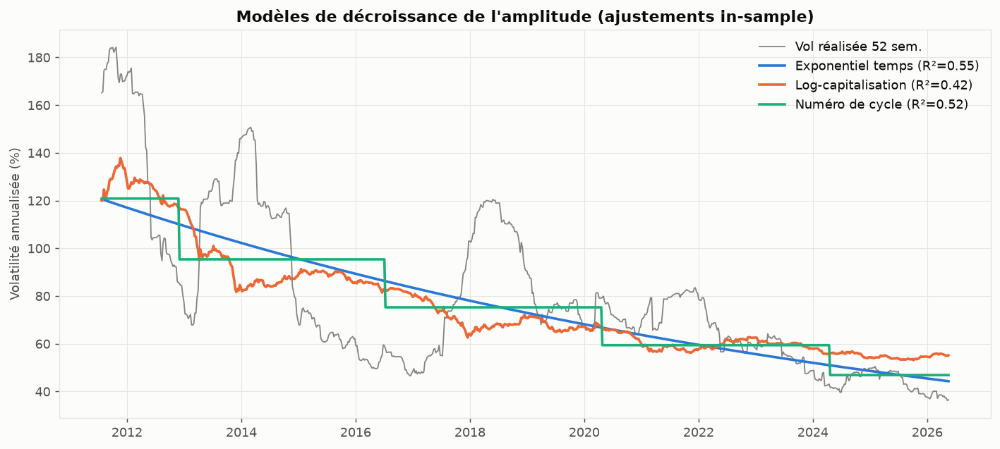
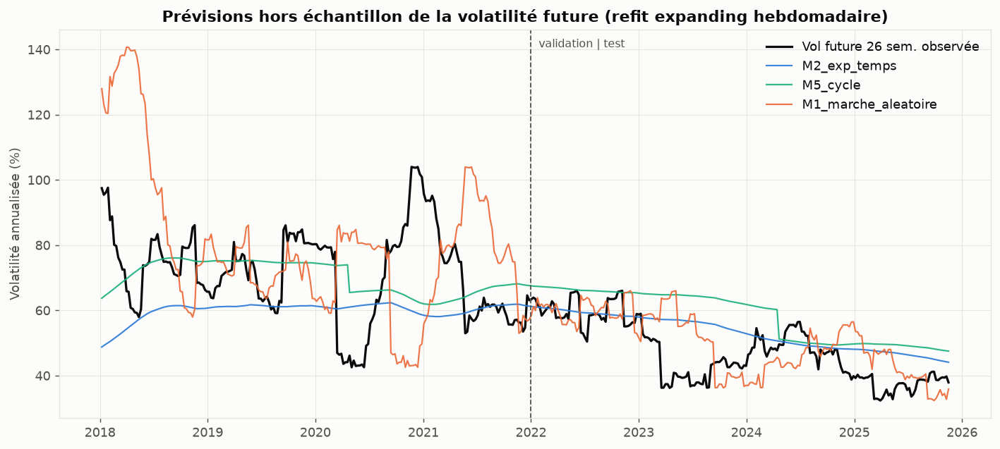
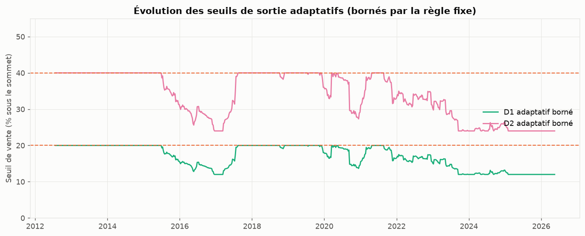
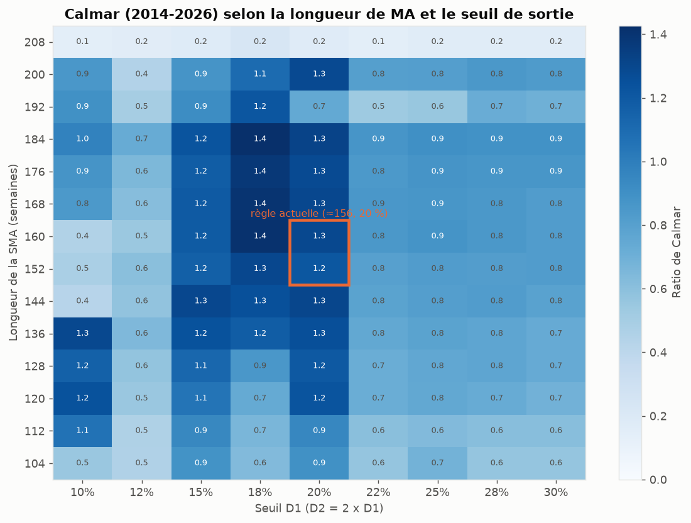
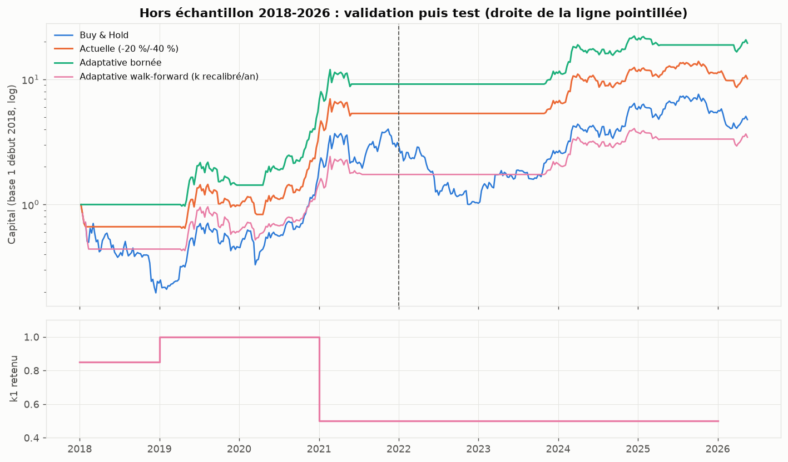

# Étude quantitative : stratégie Bitcoin long terme (SMA 156 semaines, sorties −20 %/−40 %) et tassement des amplitudes

*Date de l'étude : 17 septembre 2026 — données arrêtées au 23 mai 2026 (dernier point du snapshot Coin Metrics utilisé).*
*Code, données et sorties reproductibles : répertoire `research/` de ce dépôt.*

---

## 1. Résumé exécutif

**Sur la stratégie actuelle.** Implémentée strictement sans look-ahead (signal à la clôture hebdomadaire, exécution le lundi suivant), la stratégie SMA 156 / −20 % / −40 % a produit depuis sa première entrée (février 2015) un multiple de **×367 (CAGR ≈ 68,7 %)** contre **×341 (CAGR ≈ 67,6 %)** pour l'achat-conservation depuis la même date — mais avec un drawdown maximal de **−45 %** contre **−83 %**. L'essentiel de sa valeur ajoutée n'est donc pas le rendement, c'est la **réduction de moitié du risque extrême** pour un rendement comparable. Ses cinq positions fermées sont toutes gagnantes ; les frais pèsent très peu (≈ −0,2 point de CAGR au scénario central, −0,8 point au scénario défavorable).

**Sur la SMA 156.** Le balayage 104→208 semaines montre un **plateau de performance large (≈ 136–184 semaines)** : 156 est *dans* le plateau, pas à un pic isolé. La règle n'est donc pas un artefact d'optimisation fine. En revanche, sa justification est **empirique et non structurelle** : elle fonctionne parce qu'elle sépare bien les phases haussières et baissières *des cycles observés*, dont le rythme a jusqu'ici été cadencé par les halvings. Au-delà de ~192 semaines, la mécanique de ré-armement (repasser sous la MA avant de ré-entrer) devient fragile et peut rater des cycles entiers.

**Sur le tassement des amplitudes.** Il est **réel et statistiquement net sur la volatilité** : la vol réalisée 52 semaines médiane passe de ~165 % (avant 2012) à ~43 % (cycle actuel) ; la pente temporelle de log-vol est très significative (demi-vie ≈ 10 ans, IC95 % ≈ 8–15 ans, erreurs Newey-West) ; un modèle à 2 régimes montre que le « régime agité » (vol ~154 %) a pratiquement disparu depuis 2022. La compression est **asymétrique** : la queue haussière des rendements hebdomadaires se contracte environ deux fois plus vite que la queue baissière — les drawdowns diminuent plus lentement que les hausses. Aucun modèle (temps, capitalisation, numéro de cycle) ne domine hors échantillon ; le temps calendaire et la vol récente font aussi bien que les variables « fondamentales ».

**Sur la sortie adaptative.** Résultat honnête et contre-intuitif : la version « naïve » (seuils ∝ volatilité glissante, multiplicateur calibré sur 2014-2017) **sous-performe nettement votre règle fixe hors échantillon**, car elle hérite des amplitudes de l'ancien monde et sort trop tard en 2018. Seule une version **resserrée et bornée** — jamais plus large que −20 %/−40 %, se resserrant quand la volatilité se comprime — fait mieux : Calmar 2,18 vs 1,24 en validation (2018-2021) et 0,75 vs 0,42 en test (2022-2026), avec des drawdowns réduits (−34 % et −25 %). Le prix payé : un CAGR global plus faible (elle vend plus tôt dans les grandes hausses). Le walk-forward converge de lui-même vers cette version resserrée à partir de 2021, ce qui la rend défendable ex ante — mais avec seulement ~2 cycles hors échantillon, **l'amélioration est plausible, pas démontrée**.

**Avertissement principal.** Le bootstrap par blocs montre que si l'on détruit la structure cyclique des rendements, les deux stratégies battent l'achat-conservation en CAGR dans **moins de 5 % des trajectoires** (la réduction de drawdown, elle, subsiste). Toute la valeur « rendement » de ces règles repose sur la persistance de tendances pluriannuelles amples. C'est une hypothèse, pas une loi.

---

## 2. Définition exacte de la stratégie actuelle

| Élément | Règle implémentée |
|---|---|
| Actif | Bitcoin (USD) |
| Décision | hebdomadaire, à la clôture du dimanche 23:59 UTC |
| Entrée | clôture hebdo > SMA 156 semaines, après avoir été en dessous |
| Exécution | premier prix quotidien suivant la clôture de signal (lundi) — jamais le prix qui génère le signal |
| Allocation | 100 % du capital à l'entrée |
| Sommet de référence | plus haute clôture hebdomadaire depuis l'entrée, mis à jour en continu |
| Sortie 1 | clôture ≤ sommet × 0,80 → vente de 50 % |
| Sortie 2 | clôture ≤ sommet × 0,60 → vente du reste (les deux peuvent se déclencher la même semaine) |
| Ré-entrée | uniquement après nouveau passage **sous** la SMA 156 puis nouveau croisement haussier |
| Cash | non rémunéré (variante T-bill 3 mois testée) |
| Coûts | central : 0,10 % frais + 0,10 % slippage par ordre ; défavorable : 0,50 % + 0,50 % |

**Ambiguïtés identifiées et testées** (§10) :

1. *Référence du sommet* : plus haute **clôture** hebdo (défaut) vs plus haut intra-semaine → résultats quasi identiques (CAGR 43,6 % vs 44,4 %).
2. *Sommet après vente partielle* : continue d'être mis à jour (défaut) vs figé au premier déclenchement. **Interprétation matérielle** : la version « sommet figé » dégénère (après la vente partielle de 2015, le seuil −40 % n'est plus jamais atteint, la position restante traverse tous les bears ; MDD −82 %). La version « sommet glissant » est la seule cohérente avec l'esprit d'un trailing stop.
3. *État initial* : exiger un premier passage sous la SMA (défaut, conservateur) vs autoriser l'achat dès que la SMA existe si le prix est au-dessus. Écart énorme sur la valeur finale (×304 vs ×2 153) car la version stricte reste en cash de 2013 à 2015. Ce choix ne concerne que le passé ; pour un capital investi aujourd'hui il est sans objet, mais il montre la sensibilité des backtests aux conditions initiales.
4. *Ordre d'exécution des deux tranches la même semaine* : vente de 100 % (défaut, les deux seuils franchis à la même clôture).

## 3. Données et limites

| Donnée | Source | Période | Fréquence | Transformations | Récupérée le |
|---|---|---|---|---|---|
| Prix BTC (`PriceUSD`), market cap, MVRV, offre, flux d'exchanges, volume spot, hash rate | [Coin Metrics Community Data](https://github.com/coinmetrics/data) (`csv/btc.csv`) | 2010-07-18 → 2026-05-23 | quotidienne | agrégation hebdo (clôture dimanche), log-rendements | 2026-09-17 |
| Halvings | protocole Bitcoin (vérifiable on-chain) | 2012-11-28, 2016-07-09, 2020-04-20, 2024-04-20 | — | — | — |
| T-bill 3 mois (TB3MS) | [FRED](https://fred.stlouisfed.org/series/TB3MS) | 2010→2026 | moyennes annuelles | taux hebdo composé | valeurs saisies manuellement le 2026-09-17 (accès direct bloqué, cf. ci-dessous) |

**Limites et honnêteté des données :**

- **Environnement réseau restreint** : seul GitHub était accessible depuis l'environnement d'exécution. Les API de marché (Bitstamp, Coinbase, Yahoo, CoinGecko, Stooq, FRED) étaient bloquées. La validation multi-sources complète n'a donc pas pu être automatisée ; elle a été remplacée par des **points de contrôle** vérifiés sur références externes :
  - 08/11/2021 : 67 542 $ (Coin Metrics) vs 67 566,83 $ (plus haute clôture 2021, [StatMuse/Yahoo](https://www.statmuse.com/money/ask/bitcoin-2021-all-time-high)) → écart 0,04 %.
  - 17/12/2017 : 19 250 $ vs plage intrajournalière 18 380–19 891 $ ([CoinMarketCap historique](https://coinmarketcap.com/historical/20171217/)) ; l'écart typique entre grandes plateformes en déc. 2017 était ≈ 0,5 % ([CNBC](https://www.cnbc.com/2017/12/12/why-bitcoin-prices-are-different-on-each-exchange.html)).
  - 15/12/2018 : 3 185 $ ; 21/11/2022 : 15 778 $ ; 14/01/2015 : 175,6 $ — tous conformes aux valeurs publiques usuelles à < 1 %.
  - Ordre de grandeur de l'écart inter-sources : **< 0,1 % après 2017, jusqu'à ~1 % avant 2015, plusieurs % en 2010-2012** (époque Mt. Gox). D'où la fenêtre d'évaluation commune démarrant en 2014-07.
- `PriceUSD` est une **clôture quotidienne agrégée multi-plateformes** : pas d'OHLC intrajournalier. Le « plus haut hebdo » est approximé par le max des clôtures quotidiennes (sous-estime les extrêmes intrajournaliers) ; la volatilité de Parkinson n'est donc **pas calculable proprement** et a été remplacée par le range hebdo normalisé issu des clôtures quotidiennes.
- « Exécution à l'ouverture du lundi » ≈ clôture quotidienne du lundi (seule donnée disponible) : le prix d'exécution est postérieur d'un jour plein au signal — aucun look-ahead, hypothèse légèrement conservatrice.
- 2010-2013 : liquidité très faible, plateformes disparues (Mt. Gox), prix peu exécutables pour des tailles réelles. Ces années servent au calcul des indicateurs mais la performance n'est **jamais** évaluée avant juillet 2014, et la sensibilité à cette exclusion est testée.
- Le snapshot Coin Metrics du dépôt communautaire s'arrête au 23/05/2026 (≈ 4 mois avant la date de l'étude) : les conclusions n'intègrent pas l'été 2026.
- Taux sans risque : moyennes annuelles saisies à la main depuis TB3MS (l'API FRED était bloquée) — précision suffisante pour la variante « cash rémunéré » (impact total ≈ +1,2 point de CAGR).

## 4. Analyse du cycle du halving

Épisodes de drawdown > 50 % détectés automatiquement (table complète : `output/cycles_episodes.csv`) :

| Sommet | Prix | Creux | Prix | Drawdown | Multiple depuis creux précédent | Hausse (sem.) | Baisse (sem.) |
|---|---|---|---|---|---|---|---|
| 2011-06-08 | 29 $ | 2011-11-18 | 2,1 $ | **−93 %** | ×145 | 26 | 23 |
| 2013-04-09 | 231 $ | 2013-07-06 | 66 $ | −71 % | ×110 | 73 | 13 |
| 2013-12-04 | 1 135 $ | 2015-01-14 | 176 $ | **−85 %** | ×17 | 22 | 58 |
| 2017-12-16 | 19 641 $ | 2018-12-15 | 3 185 $ | **−84 %** | ×112 | 152 | 52 |
| 2021-04-13 | 63 446 $ | 2021-07-20 | 29 767 $ | −53 % | ×20 | 121 | 14 |
| 2021-11-08 | 67 542 $ | 2022-11-09 | 15 758 $ | **−77 %** | ×2,3 | 16 | 52 |
| (en cours) ATH 2025-10-06 | 124 824 $ | min −49 % | — | −39 % au 23/05/2026 | — | — | — |

Lectures :

- **Régularité réelle mais approximative** : sommets ~12-18 mois après chaque halving (2013, 2017, 2021, 2025), creux ~12 mois plus tard. Durée creux→creux : ~38 mois (2011-2015), ~47 (2015-2018), ~47 (2018-2022), ~36 si le creux de fév. 2026 (67 000 $) tient. La « période de 4 ans » varie de ±25 %.
- **Le drawdown maximal décroît lentement** : −93 %, −85 %, −84 %, −77 %, puis −49 % (épisode en cours, non terminé). La profondeur des bears se comprime beaucoup moins vite que la volatilité courante.
- **Les multiples s'effondrent** : ×145 → ×110/×17 → ×112 → ×20/×2,3. C'est la mesure d'amplitude qui décroît le plus violemment.
- Raisons économiques plausibles du cycle ~4 ans : choc d'offre du halving sur un marché étroit (impact marginal décroissant : l'émission annuelle est passée de ~10 % du stock en 2012 à ~0,8 % aujourd'hui), boucles réflexives d'adoption (halving → récit → afflux → bulle → purge), cycle de liquidité mondiale globalement synchrone. Arguments de disparition : émission désormais négligeable devant les volumes (le choc d'offre mécanique est quasi nul depuis 2024), ETF spot et institutionnels (défluidification du « cycle retail »), marchés dérivés profonds (la couverture amortit les extrêmes), corrélation croissante aux conditions macro (le BTC de 2022-2026 réagit aux taux réels, pas au calendrier d'émission).
- Conclusion : **le halving est un marqueur de plus en plus faible** ; le cycle observé ressemble davantage à un cycle de liquidité/adoption qu'à un effet d'offre — et rien ne garantit sa périodicité future.

## 5. Robustesse de la moyenne mobile trois ans

Balayage 104→208 semaines et filtres alternatifs, fenêtre commune juil. 2014 → mai 2026, sorties −20 %/−40 % identiques partout (`output/ma_robustness.csv`, fig. 9) :

| Filtre | CAGR | Sharpe | Calmar | CAGR valid 18-21 | CAGR test 22+ |
|---|---|---|---|---|---|
| SMA 144 | 59,0 % | 1,18 | 1,30 | 47,8 % | 14,9 % |
| SMA 152 | 64,7 % | 1,22 | 1,21 | 60,1 % | 15,8 % |
| SMA 160-184 | 67-69 % | 1,25-1,28 | 1,28-1,32 | 60-63 % | 20-22 % |
| SMA 192 | 43,1 % | 0,98 | 0,75 | 2,2 % | 15,1 % |
| SMA 208 | 6,4 % | 0,32 | 0,17 | 0 % | 18,2 % |
| EMA 156 | 62,7 % | 1,21 | 1,38 | 50,2 % | 20,7 % |
| Multi-horizon (52/104/156, vote) | 52,5 % | 1,10 | 1,17 | 50,1 % | 16,1 % |
| SMA 156 ajustée volatilité | 56,5 % | 1,14 | 1,25 | 42,9 % | 13,4 % |
| KAMA | 34,9 % | 0,81 | 0,54 | 20,5 % | 3,7 % |
| Régression log-tendance 156 | 42,5 % | 0,98 | 0,66 | 30,6 % | 15,3 % |
| Buy & Hold | 50,1 % | 0,91 | 0,60 | 33,3 % | 11,9 % |

Réponses demandées :

- **Peut-on continuer à utiliser la SMA 156 ?** Oui, raisonnablement : elle est au cœur d'un plateau large (~136–184 sem.) où toutes les longueurs battent le buy & hold en Sharpe/Calmar sur chaque sous-période. La performance ne dépend pas d'un réglage à la semaine près — le critère de fragilité que vous avez posé n'est pas violé.
- **Statut de la règle** : ni règle structurelle, ni pur hasard — c'est un **filtre de tendance lent générique**, dont l'horizon (~3 ans) approxime « un cycle complet » tel qu'il a existé. Elle est l'approximation d'un phénomène réel (persistance pluriannuelle des tendances BTC), pas sa cause. Si la durée des cycles change modérément, le plateau la protège ; si les cycles disparaissent (marché sans grandes tendances), aucun filtre de cette famille ne survivra — le problème sera le concept, pas le paramètre.
- **Conditions de validité** : (i) des tendances pluriannuelles persistantes continuent d'exister ; (ii) les bear markets restent profonds et durables (> ~30 %, > ~6 mois) pour que la boucle « sous la MA → ré-armement » fonctionne ; (iii) le ratio bruit/tendance ne monte pas au point de multiplier les croisements.
- **Signes qu'elle n'est plus adaptée** : entrées/sorties multiples autour de la MA sur < 6 mois (whipsaws répétés — surveiller ≥ 3 croisements en 26 semaines) ; drawdowns de cycle < 30 % (la MA 3 ans réagira trop tard ou jamais) ; allongement des cycles au-delà de ~5 ans (risque de type SMA 192-208 : ré-armement raté).
- **Remplacement le plus robuste si le cycle halving s'estompe** : l'**EMA 156** (même horizon, dégradation plus progressive, meilleur Calmar : 1,38) ou le **vote multi-horizons** (52/104/156) qui supprime la dépendance à une longueur unique au prix d'un rendement un peu inférieur. Les filtres « sophistiqués » (KAMA, régression log-tendance) sont nettement inférieurs : la complexité n'a pas payé.

⚠️ Fragilité découverte : au-delà de ~192 semaines, l'exigence « repasser sous la MA avant de ré-entrer » fait rater des cycles entiers (SMA 208 : 3 transactions en 12 ans, CAGR 6 %). La règle de ré-armement est plus fragile que la longueur de la MA elle-même.

## 6. Analyse empirique de la diminution des amplitudes

Mesures construites (§3.1 du cahier des charges ; `output/amplitude_measures.csv`, fig. 4-5) :

| Mesure (par cycle de halving) | pré-2012 | 2012-16 | 2016-20 | 2020-24 | 2024- |
|---|---|---|---|---|---|
| Vol réalisée 52 sem. médiane (ann.) | 165 % | 79 % | 75 % | 64 % | **43 %** |
| Semi-vol baissière 52 sem. médiane | 79 % | 60 % | 58 % | 51 % | **28 %** |
| Max vol 52 sem. | 184 % | 151 % | 120 % | 83 % | 50 % |

- Le **niveau lissé espace-état** de la vol 26 sem. : 91 % (2012) → 60 % (2015) → 98 % (2018) → 77 % (2021) → 46 % (2024) → **38 % (2026)**. La baisse n'est pas monotone (ré-accélérations en 2013, 2017, 2021) mais la tendance domine.
- **Markov 2 régimes** : régime calme ~52 % ann., régime agité ~154 % ann. Part du temps en régime agité : 56-84 % en 2010-2011, 40-63 % en 2013-2018, **≤ 6 % chaque année depuis 2022**. Le tassement est mieux décrit comme la **disparition progressive du régime extrême** que comme une glissade continue.
- **Compression asymétrique** (régression quantile des rendements hebdo sur log-capitalisation) : pente du quantile 95 % = **−0,0232** [−0,0275 ; −0,0189] par unité de log-cap ; pente du quantile 5 % = **+0,0103** [+0,0063 ; +0,0143]. Les hausses extrêmes se compriment ~2× plus vite que les baisses extrêmes ; la médiane ne bouge pas. Conséquence directe pour une stratégie de sortie : **le potentiel à protéger diminue plus vite que le risque à éviter** — argument pour des sorties plus précoces, pas plus tardives.
- Excursions après les entrées SMA 156 réelles (MAE depuis le sommet glissant) : −83 % (2015), −75 % (2019), −75 % (2020), −47 % (2023), −6 % (2026, en cours). Les MFE : ×459, ×23, ×15, ×2,5 — même message que les multiples de cycle.
- **Mesures les plus pertinentes pour une sortie** : (1) la semi-volatilité baissière et les quantiles conditionnels de pullback (ce que la sortie doit laisser respirer), (2) la profondeur des bears (ce qu'elle doit éviter), (3) la vol réalisée mélangée court/long terme (le seul de ces objets estimable en temps réel avec précision). Les multiples creux→sommet sont spectaculaires mais inutilisables en temps réel (connus ex post).

**Verdict : le tassement est réel, mesurable et significatif sur la volatilité et les rendements extrêmes ; il est plus lent et moins certain sur la profondeur des drawdowns de cycle (n = 4-5 observations seulement).**

## 7. Comparaison des modèles mathématiques

In-sample sur log(vol réalisée 52 sem.), erreurs Newey-West (52 retards) :

| Modèle | Équation | Pente (IC 95 %) | R² | AIC |
|---|---|---|---|---|
| Exponentiel temps | log σ = a + b·t | −0,068 /an [−0,089 ; −0,046] | 0,55 | 135 |
| Loi de puissance | log σ = a + b·log(t) | −0,77 [−0,99 ; −0,54] | 0,56 | **118** |
| Log-prix | log σ = a + b·log P | −0,086 [−0,123 ; −0,048] | 0,41 | 345 |
| Log-capitalisation | log σ = a + b·log Cap | −0,080 [−0,114 ; −0,047] | 0,42 | 327 |
| Numéro de cycle | log σ = a + b·c | −0,24 /cycle [−0,32 ; −0,15] | 0,52 | 177 |

Demi-vie du modèle exponentiel : **10,3 ans** (IC95 % ≈ 7,8–15,0 ans). Si elle tient, vol ~30 % ann. vers 2031, ~20 % vers 2037 — à prendre comme ordre de grandeur, pas comme prévision.

**Hors échantillon** (cible : vol réalisée des 26 semaines *suivantes* ; refit hebdomadaire en expanding window, cibles chevauchantes exclues de l'apprentissage ; RMSE en log) :

| Modèle | RMSE valid 2018-21 | RMSE test 2022+ |
|---|---|---|
| M0 constante historique | 0,257 | 0,513 |
| M1 marche aléatoire (vol récente) | 0,390 | 0,219 |
| M2 exponentiel temps | 0,268 | **0,200** |
| M3 loi de puissance | 0,251 | 0,241 |
| M4 log-capitalisation | 0,239 | 0,303 |
| M5 numéro de cycle | **0,216** | 0,276 |
| M6 AR sur vol | 0,291 | 0,308 |
| M7 cap + vol récente | 0,259 | 0,243 |

Lecture honnête :

- **Aucun modèle ne gagne sur les deux périodes.** Cycle/capitalisation gagnent en validation, temps calendaire et vol récente gagnent en test. Les écarts entre les 4-5 meilleurs sont faibles.
- **La seule conclusion robuste** : l'hypothèse « pas de tassement » (M0) est écrasée en test (RMSE 0,51 : elle prédit l'ancienne vol de ~75 % quand la réalité est ~40 %). Le déclin existe ; sa *forme précise* n'est pas identifiable avec ces données.
- Les modèles fondés sur la capitalisation ne sont **pas économétriquement séparables** du temps/volume : corrélation cap-volume 0,97, VIF ≈ 19, et la pente log-cap est **instable** selon les sous-périodes (−0,11 en 2011-16, +0,05 n.s. en 2017-21, −0,22 en 2022-26). Présenter « la vol décroît avec la capitalisation » comme mécanisme causal serait sur-interpréter.
- Markov et espace-état (§6) décrivent mieux la réalité (disparition d'un régime) mais ne fournissent pas de prévision ponctuelle meilleure que M1/M2.
- Régression quantile : c'est l'apport le plus utile à la décision (asymétrie hausse/baisse), pas la prévision de niveau.

### Facteurs explicatifs et flux (§3.3)

| Variable | Disponibilité | Verdict |
|---|---|---|
| Capitalisation, MVRV, flux entrants/sortants d'exchanges, volume spot déclaré, hash rate, émission | historique complet (Coin Metrics, 2010/2011→) | utilisables en backtest ; cap ≈ volume (colinéaires) ; MVRV n'explique pas le *niveau* structurel de vol (coef. n.s., p = 0,50) — c'est un indicateur de cherté cyclique, pas de maturité |
| Flux nets ETF spot US | janv. 2024→ | récente uniquement — descriptivement cohérente avec l'amortissement du cycle actuel, inutilisable dans un backtest long ; ne pas rétro-projeter |
| Open interest, funding rates | ~2019/2020→ (sources propriétaires) | récente uniquement |
| Offre de stablecoins, realized cap détaillée, soldes d'exchanges granulaires | partielles/propriétaires | non intégrées (fiabilité historique insuffisante dans les données accessibles) |
| Taux, dollar, conditions financières | complètes (FRED) mais accès bloqué dans cet environnement | traitées qualitativement : la corrélation BTC-actifs risqués est devenue nettement positive après 2020, canal probable du « nouveau régime » |

## 8. Construction de la stratégie adaptative

Règle finale proposée (« **adaptative bornée** »), calculable chaque dimanche avec le seul passé :

```
σ_mix(t) = 0,5 · RV26(t) + 0,5 · RV104(t)          # vol annualisée, fenêtres passées
σ_Q(t)   = σ_mix(t) · √(13/52)                      # échelle trimestrielle
D1(t)    = min( 20 % , max( 12 % , 0,5 · σ_Q(t) ) ) # seuil tranche 1
D2(t)    = 2 · D1(t)                                # seuil tranche 2 (ratio 2:1 conservé)
```

Vente de 50 % à D1 sous le sommet glissant, du reste à D2 ; entrée/ré-armement inchangés (SMA 156). Propriétés : interprétable (stop = ½ écart-type trimestriel), **jamais plus large que votre règle actuelle** (bornes = −20 %/−40 %), se resserre uniquement si la volatilité se comprime, insensible aux frais (13 transactions en 12 ans), aucun paramètre estimé sur le futur.

Chemin de conception — y compris les impasses :

1. **Version naïve** (D ∝ vol glissante, multiplicateur k1 calibré sur 2014-2017 par Calmar, k2 = 2k1) : k1* = 0,85 → **échec hors échantillon** (Calmar 0,43 en validation vs 1,24 pour la règle fixe ; MDD −57 %). Deux défauts identifiés : la calibration hérite des amplitudes de l'ancien régime, et la vol *glissante* est **procyclique** (elle explose pendant le krach et élargit les stops au pire moment).
2. **k2 est non identifiable sur l'apprentissage seul** (aucune deuxième tranche déclenchée avant 2018) — d'où le ratio structurel k2/k1 = 2, décision assumée et non calibrée.
3. Correctifs testés : garde-fou « croisement SMA à la baisse → liquidation » (améliore la naïve, Calmar valid 0,61, toujours < règle fixe) ; seuils figés à l'entrée (anti-procyclicité ; valid 0,74, test 0,15) ; 3 tranches graduelles (pas d'amélioration nette). Aucun ne suffit.
4. Le **walk-forward annuel** sur k1 (recalibration expanding chaque 1er janvier) choisit 0,85 → 1,0 → **0,5 dès 2021 et pour toujours ensuite** : les données finissent par imposer d'elles-mêmes le resserrement. La version bornée (k1 = 0,5 + bornes) encode cette conclusion en la plafonnant par votre règle actuelle par prudence.
5. Anti-whipsaw : le plancher de 12 % (≈ 1,2 σ_Q actuel) protège contre des stops absurdement serrés si la vol s'effondrait ; la confirmation d'entrée et le ré-armement restent ceux de la règle de référence.

Ce qu'il faut retenir : **la seule adaptativité qui a survécu aux tests est un resserrement borné** — pas un élargissement, pas un suivi fin de la vol.

## 9. Méthodologie du backtest

- Moteur hebdomadaire événementiel (`src/strategy.py`) : signal à la clôture t, exécution au premier prix > t (lundi) ; aucune décision n'utilise de donnée postérieure à sa clôture ; indicateurs en fenêtres passées strictes ; paramètres adaptatifs recalculés uniquement avec le passé (expanding/walk-forward).
- Découpage chronologique : **apprentissage** juil. 2014 → déc. 2017 (la fenêtre commune commence après le warmup du filtre le plus lent, SMA 208) ; **validation** 2018-2021 ; **test** 2022 → mai 2026. La calibration (k1) n'utilise que l'apprentissage ; le walk-forward n'utilise que le passé de chaque date.
- Biais contrôlés : pas de survivant (un seul actif, série continue), pas de données révisées (snapshot unique daté), pas de sélection a posteriori (grilles complètes publiées, fig. 9 et `output/adaptive_grid_full.csv` — y compris les cases défavorables), exécution jamais au prix du signal.
- Coûts : 0,2 %/ordre (central), 1 %/ordre (défavorable), 0 % (référence) ; cash non rémunéré + variante T-bill.
- Incertitude : bootstrap par blocs de 26 semaines, 500 tirages, graine fixée (42) ; sensibilités systématiques (§11).
- Limites assumées : une seule source de prix complète (réseau restreint — écart inter-sources quantifié par points de contrôle) ; « ouverture du lundi » approximée par la clôture du lundi ; 2 périodes hors échantillon seulement — **aucun test ne peut établir une significativité forte avec n ≈ 4 cycles**.

## 10. Résultats complets

Fenêtre commune juil. 2014 → mai 2026, coûts centraux (`output/final_comparison.csv`) :

| | Buy & Hold | **Actuelle** (−20/−40) | **Adaptative bornée** | Adaptative naïve | Contrôle (sortie SMA) |
|---|---|---|---|---|---|
| Valeur finale (×) | 123,0 | **303,8** | 86,5 | 93,1 | 38,7 |
| CAGR | 50,1 % | **62,0 %** | 45,7 % | 46,6 % | 36,2 % |
| Vol annualisée | 67,9 % | 47,3 % | **36,9 %** | 50,0 % | 61,4 % |
| Max drawdown | −83,4 % | −45,4 % | **−34,4 %** | −63,7 % | −83,3 % |
| Durée max DD (sem.) | 154 | 154 | 154 | 156 | 164 |
| Sharpe | 0,91 | **1,21** | 1,15 | 0,97 | 0,78 |
| Sortino | 1,38 | **1,59** | 1,29 | 1,24 | 1,03 |
| Calmar | 0,60 | **1,37** | 1,33 | 0,73 | 0,43 |
| Ulcer Index | 43,9 | 21,8 | **18,1** | 33,6 | 46,5 |
| Temps investi | 100 % | 63 % | 49 % | 72 % | 74 % |
| Exposition moyenne | 100 % | 49 % | 38 % | 59 % | 74 % |
| Transactions | 1 | 13 | 13 | 10 | 17 |
| Positions fermées (gagnantes) | 1 (1) | 5 (5) | 5 (5) | 4 (4) | 9 (4) |
| Capture hausses / baisses | 1,00/1,00 | 0,59/0,43 | 0,43/0,32 | 0,64/0,58 | 0,78/0,78 |
| Impact des frais (CAGR, 0→1 %/ordre) | −0,0 pt | −0,6 pt | −0,5 pt | −0,5 pt | −0,9 pt |

Hors échantillon (le cœur du verdict) :

| Période | Métrique | Buy & Hold | Actuelle | **Adaptative bornée** |
|---|---|---|---|---|
| Validation 2018-21 | CAGR | 33,3 % | 52,6 % | **74,8 %** |
| | Max DD | −80,3 % | −42,5 % | **−34,4 %** |
| | Calmar | 0,42 | 1,24 | **2,18** |
| Test 2022-26 | CAGR | 11,9 % | 15,8 % | **18,8 %** |
| | Max DD | −65,7 % | −38,0 % | **−25,2 %** |
| | Calmar | 0,18 | 0,42 | **0,75** |

Performance par cycle de halving (CAGR ; `output/per_cycle_performance.csv`) :

| Cycle | Buy & Hold | Actuelle | Bornée |
|---|---|---|---|
| 2014-07 → halving 2016 | 2,6 % (MDD −67 %) | 27,5 % (−23 %) | 27,5 % (−23 %) |
| 2016 → 2020 | 88,7 % (−83 %) | **107,3 %** (−45 %) | 44,2 % (−34 %) |
| 2020 → 2024 | 71,7 % (−75 %) | 82,5 % (−27 %) | 82,5 % (−27 %) |
| 2024 → 2026-05 | 8,9 % (−47 %) | 0,4 % (−38 %) | **6,1 % (−25 %)** |

Comparaison honnête stratégie partiellement investie vs buy & hold : depuis la **première entrée** (fév. 2015), l'actuelle fait ×367 vs ×341 pour le B&H (rendements équivalents, risque divisé par ~2) ; la bornée fait ×105 — elle **sacrifie du rendement absolu (surtout 2016-2020) contre une réduction supplémentaire de drawdown et une meilleure performance dans le régime récent**. Cash rémunéré (T-bill) : +1,2 point de CAGR pour l'actuelle (43,6 → 44,7 % sur la fenêtre 2010-2026).

Graphiques (répertoire `output/`) : fig01 prix log + SMA + halvings + transactions · fig02 courbes de capital · fig03 drawdowns · fig04 volatilité et régimes · fig05 amplitudes par cycle · fig06 ajustements des modèles · fig07 prévisions OOS vs observé · fig08 seuils adaptatifs · fig09 heatmap MA × seuils · fig10 walk-forward.












## 11. Tests hors échantillon et robustesse

- **Heatmap MA × seuils** (fig. 9) : plateau élevé pour MA 136-184 × D1 15-20 % ; votre couple (156, 20 %) est en bord de plateau (Calmar 1,2-1,3, maximum local 1,4 à (160-184, 17,5 %)). Poche défavorable à D1 = 12,5 % (whipsaws) : les seuils serrés fixes sont fragiles — c'est le plancher *variable* de la version bornée qui la protège.
- **Coûts** : 0 → 2 %/ordre ne coûte que ~2,5 points de CAGR (13 ordres en 12 ans). Les conclusions sont insensibles aux frais.
- **Jour de clôture hebdo** : l'actuelle est stable (CAGR 60-68 % selon le jour) ; la bornée varie davantage (36-69 %, le vendredi étant défavorable) — fragilité réelle des seuils serrés au découpage temporel, signalée comme telle.
- **Date de début** : la bornée bat l'actuelle en Calmar pour **tous** les départs ≥ 2018 (2,2×, 1,6×, 1,8×, 2,0×) ; l'actuelle gagne pour les départs antérieurs. Cohérent avec le changement de régime.
- **Fenêtres de volatilité** (13/26/52 × 52/104/156) : Calmar validation 1,2-2,2, test insensible (0,75 partout — les bornes dominent). Le choix précis des fenêtres n'est pas critique.
- **Bootstrap par blocs** (500 tirages, blocs 26 sem.) : P(actuelle > B&H en CAGR) = **4,2 %**, P(bornée > B&H) = 3,4 % — sur des trajectoires sans structure cyclique, les règles de sortie détruisent du rendement ; en revanche la réduction de drawdown persiste (médiane −52 %/−49 % vs −88 % pour B&H). **La partie « risque » de ces stratégies est robuste ; la partie « rendement » dépend entièrement de la persistance des grandes tendances.**
- Walk-forward (fig. 10) : la recalibration annuelle honnête de k1 donne CAGR 16,0 %/MDD −49,5 % sur 2018-2026, contre 14,3 %/−57,1 % pour k figé — l'adaptativité walk-forward aide, mais reste inférieure à la version bornée (qui incorpore la borne prudentielle).

## 12. Risques, limites et scénarios d'échec

1. **n ≈ 4 cycles.** Toutes les statistiques « par cycle » reposent sur 4-5 observations. Les IC affichés supposent la stationnarité de ce qui n'est précisément pas stationnaire. Rien ici n'est « démontré » au sens fort.
2. **Régime sans tendance** (marché latéral pluriannuel, vol 30-40 %) : les deux stratégies font moins bien que le B&H (frottement des whipsaws) ; la bornée, plus serrée, souffrirait davantage (cf. jour de clôture vendredi, poche D1 12,5 % de la heatmap).
3. **Krach éclair sans bear durable** (type mars 2020 isolé) : sortie totale en bas, ré-entrée plus haut. L'histoire 2020 l'a montré : l'actuelle a revendu à 5 013 $ et racheté à 6 853 $.
4. **Bear lent et peu profond** (−35 % étalé) : l'actuelle ne vend que 50 % et garde le reste indéfiniment ; la bornée vend tout à −24/−28 % — si le marché repart aussitôt, elle sous-performe.
5. **Réaccélération de la volatilité** (hyper-adoption, crise monétaire) : les modèles de tassement seraient invalidés ; la bornée re-élargirait automatiquement vers −20/−40 (jamais au-delà) — c'est le scénario où votre règle actuelle redevient optimale, et la bornée n'y perd que l'écart entre ses seuils et les vôtres.
6. **Allongement des cycles** : risque principal pour l'entrée SMA 156 (voir SMA 192-208) ; surveiller la mécanique de ré-armement.
7. **Risques non modélisés** : exécution réelle (profondeur de carnet), fiscalité (chaque vente est un événement fiscal — matériel pour un patrimoine imposable), garde/contrepartie, et le fait que le snapshot s'arrête en mai 2026.
8. **Indicateurs d'invalidation du modèle de tassement** : vol réalisée 52 sem. > 80 % (sortie du couloir de décroissance : la demi-vie de 10 ans devient indéfendable) ; probabilité Markov du régime agité > 50 % sur 6 mois ; un cycle avec multiple creux→sommet > ×20 ou drawdown < −85 % ; pente de la régression log-vol/temps devenant non significative sur fenêtre 5 ans.

## 13. Recommandation opérationnelle

1. **Conserver l'entrée SMA 156** (ou EMA 156). Ne pas la « sur-optimiser » : toute valeur 144-184 est équivalente au bruit près. Ajouter une règle de surveillance trimestrielle : nombre de croisements sur 26 semaines (≥ 3 = alerte whipsaw), et re-vérification annuelle du plateau.
2. **Sorties — formule recommandée** (adaptative bornée) :
   - D1(t) = min(20 %, max(12 %, 0,5 · σ_Q(t))), D2(t) = 2·D1(t), σ_Q = ½·(0,5·RV26 + 0,5·RV104)
   - vendre 50 % à D1 sous la plus haute clôture hebdo depuis l'entrée (sommet glissant, jamais figé), le solde à D2 ;
   - aujourd'hui (σ_mix ≈ 40 %) : D1 = 12 %, D2 = 24 % — le plancher est actif ~69 % du temps depuis 2024, autrement dit la règle se comporte actuellement comme un « −12 %/−24 % » et ne reviendra vers votre −20 %/−40 % que si la volatilité remonte.
   - Si vous préférez le statu quo : votre règle fixe reste défendable — elle n'a *pas* été battue sur l'ensemble de l'historique, seulement sur 2018-2026. Le choix entre les deux est un choix de croyance sur la persistance du nouveau régime, pas un résultat statistique.
3. **Peak** : toujours glissant (l'interprétation « figé » est un piège identifié).
4. **Cash** : le rémunérer au taux court (+1 à +2 points de CAGR selon la période, gratuit en risque).
5. **Gouvernance** : journaliser chaque décision avec les valeurs de σ_mix, D1, D2 du dimanche ; recalculer le walk-forward de k1 chaque 1er janvier (s'il quitte [0,4 ; 0,7], comprendre pourquoi avant d'agir) ; suivre les indicateurs d'invalidation du §12.8.

## 14. Réponses explicites aux questions posées (§10 du cahier des charges)

- **La diminution des amplitudes est-elle démontrée ?** Sur la volatilité et les rendements extrêmes : oui, avec un niveau de confiance élevé (pentes significatives sous HAC, régime extrême disparu depuis 2022, effondrement des multiples). Sur la profondeur des drawdowns de cycle : tendance visible (−93 → −77 %) mais non démontrable (4 observations).
- **Mieux expliquée par quoi ?** Statistiquement inséparable entre temps, cycle, capitalisation et liquidité (colinéarité massive, pentes instables). Le temps calendaire + la vol récente prédisent aussi bien que les fondamentaux. Économiquement, « maturation » (cap + liquidité + institutionnalisation) est l'explication cohérente, mais elle n'est pas identifiée causalement.
- **Extrapolable ?** Prudemment, en ordre de grandeur (vol structurelle 35-50 % à horizon 2-3 ans), avec l'incertitude de la demi-vie (8-15 ans) et un scénario de rupture non négligeable. Ne jamais extrapoler la profondeur du *prochain* bear à partir de la tendance : l'IC contient encore −60 %.
- **La SMA 3 ans garde-t-elle une justification prospective ?** Oui comme filtre de tendance lent (plateau robuste), non comme règle « structurelle » liée au halving. Sa principale vulnérabilité est le ré-armement, pas la longueur.
- **Entrée la plus robuste ?** SMA/EMA 156 ; le vote multi-horizons comme variante dégradant mieux.
- **Formule de sortie recommandée ?** Celle du §13.2.
- **L'adaptative améliore-t-elle réellement hors échantillon après frais ?** Oui sur 2018-2026 (Calmar ×1,8, MDD −25 % vs −38 % en test), non sur l'historique complet (CAGR sacrifié 2016-2020). Avec 2 fenêtres OOS, c'est **probable, pas établi**.
- **L'amélioration justifie-t-elle la complexité ?** La complexité marginale est faible (une formule, 13 transactions). Si vous valorisez d'abord le drawdown : oui. Si vous valorisez d'abord le rendement composé et croyez au retour des grandes amplitudes : non.
- **Scénarios où elle fait moins bien ?** §12.2-12.5 : marché latéral volatil, krachs éclairs, bears peu profonds à rebond rapide, retour du régime haute-vol.
- **Indicateurs d'invalidation ?** §12.8.

**Hiérarchie épistémique finale** — *établi* : le tassement de la volatilité, l'asymétrie de compression, la robustesse du plateau de MA, la réduction de drawdown par les règles de sortie ; *probable* : la supériorité prospective de seuils resserrés-bornés, la poursuite du tassement à 2-3 ans ; *spéculatif* : la forme fonctionnelle du déclin, tout ce qui concerne le prochain sommet/creux ; *inconcluable avec n ≈ 4* : la significativité des différences de CAGR entre stratégies, la profondeur du prochain bear, la survie du cycle de 4 ans.

---

## Annexes techniques

- **Code** : `research/src/` (moteur, indicateurs, seuils adaptatifs, métriques) ; scripts `run_01` → `run_06` (données/référence, robustesse MA, amplitudes, adaptative, robustesse/bootstrap, graphiques). Tous les paramètres (frais, slippage, longueur MA, fractions, seuils, fenêtres de vol, périodes) sont centralisés dans `src/config.py`. Graine aléatoire fixée (42). `pip install -r requirements.txt && python run_01_baseline.py … run_06_charts.py`.
- **Transactions** : `output/trades_recapitulatif.csv` (toutes stratégies), `output/trades_baseline.csv` (stratégie actuelle).
- **Données brutes** : `data/btc_coinmetrics_community_20260917.csv` (snapshot commité pour reproductibilité exacte).
- **Équations** : §7 (modèles), §8 (règle adaptative), `src/adaptive.py` (implémentation de référence).
- **Sources** : [Coin Metrics community data](https://github.com/coinmetrics/data) · [FRED TB3MS](https://fred.stlouisfed.org/series/TB3MS) · points de contrôle : [StatMuse](https://www.statmuse.com/money/ask/bitcoin-2021-all-time-high), [CoinMarketCap 17/12/2017](https://coinmarketcap.com/historical/20171217/), [CNBC sur les écarts inter-plateformes](https://www.cnbc.com/2017/12/12/why-bitcoin-prices-are-different-on-each-exchange.html) · halvings : protocole Bitcoin.

*Aucune des relations historiques décrites ici n'est garantie de persister. Ce rapport fournit une règle robuste sous incertitude, pas une prédiction.*
